# System Diagrams
## Cloud Terraria - Use Case & Sequence Diagrams

---

## 🎯 Use Case Diagram

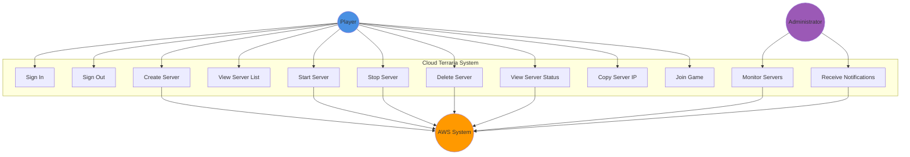

---

## 📊 Use Case Descriptions

### UC1: Sign In
**Actor**: Player  
**Precondition**: User has account or uses mock mode  
**Flow**:
1. User navigates to application
2. Clicks "Sign In"
3. Enters credentials (Mock username or Cognito)
4. System authenticates user
5. User redirected to dashboard

**Postcondition**: User is authenticated

---

### UC2: Sign Out
**Actor**: Player  
**Precondition**: User is logged in  
**Flow**:
1. User clicks "Sign Out"
2. System terminates session
3. User redirected to login page

**Postcondition**: User session ended

---

### UC3: Create Server
**Actor**: Player, AWS System  
**Precondition**: User is authenticated  
**Flow**:
1. User clicks "Create Server"
2. Fills in server details (name, version, port)
3. System validates input
4. Lambda function invoked
5. EC2 instance created
6. Server added to database
7. User sees new server in list

**Postcondition**: New server created and running

---

### UC4: View Server List
**Actor**: Player  
**Precondition**: User is authenticated  
**Flow**:
1. User accesses dashboard
2. System queries database for user's servers
3. Server list displayed with status

**Postcondition**: User sees all their servers

---

### UC5: Start Server
**Actor**: Player, AWS System  
**Precondition**: Server exists and is stopped  
**Flow**:
1. User clicks "Start" on server card
2. System invokes Lambda function
3. EC2 instance started
4. Server status updated to "running"
5. IP address displayed

**Postcondition**: Server is running

---

### UC6: Stop Server
**Actor**: Player, AWS System  
**Precondition**: Server is running  
**Flow**:
1. User clicks "Stop" on server card
2. System invokes Lambda function
3. EC2 instance stopped
4. Server status updated to "stopped"

**Postcondition**: Server is stopped

---

### UC7: Delete Server
**Actor**: Player, AWS System  
**Precondition**: Server exists  
**Flow**:
1. User clicks "Delete" on server card
2. System confirms deletion
3. Lambda terminates EC2 instance
4. Server removed from database

**Postcondition**: Server deleted

---

### UC8: View Server Status
**Actor**: Player, AWS System  
**Precondition**: Server exists  
**Flow**:
1. System polls server status
2. Lambda queries EC2 status
3. Status displayed (pending/running/stopped)

**Postcondition**: Current status shown

---

### UC9: Copy Server IP
**Actor**: Player  
**Precondition**: Server is running  
**Flow**:
1. User clicks IP address
2. IP copied to clipboard
3. Toast notification shown

**Postcondition**: IP in clipboard

---

### UC10: Join Game
**Actor**: Player  
**Precondition**: Server is running  
**Flow**:
1. User copies server IP
2. Opens Terraria game
3. Multiplayer → Join via IP
4. Enters server IP:port
5. Connects to server

**Postcondition**: Playing on server

---

### UC11: Monitor Servers
**Actor**: Administrator  
**Precondition**: CloudWatch configured  
**Flow**:
1. Admin opens CloudWatch dashboard
2. Views metrics (CPU, memory, network)
3. Checks alarms

**Postcondition**: System health monitored

---

### UC12: Receive Notifications
**Actor**: Administrator  
**Precondition**: SNS configured  
**Flow**:
1. Server event occurs (started/stopped)
2. SNS sends email notification
3. Admin receives alert

**Postcondition**: Admin notified

---

## 🔄 Sequence Diagram: Create Server

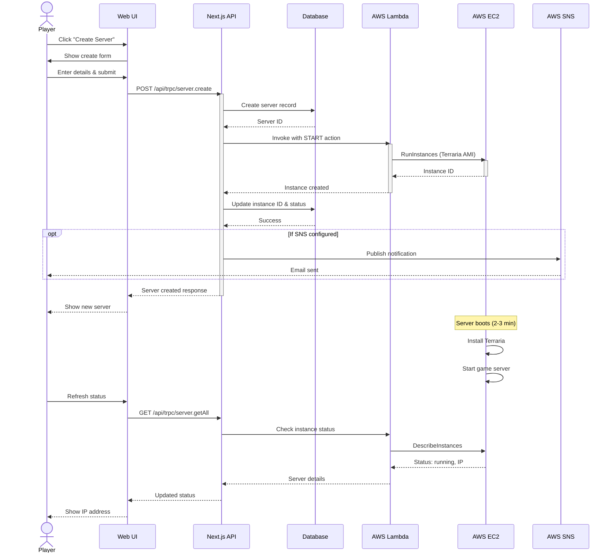

---

## 🔄 Sequence Diagram: Start Existing Server

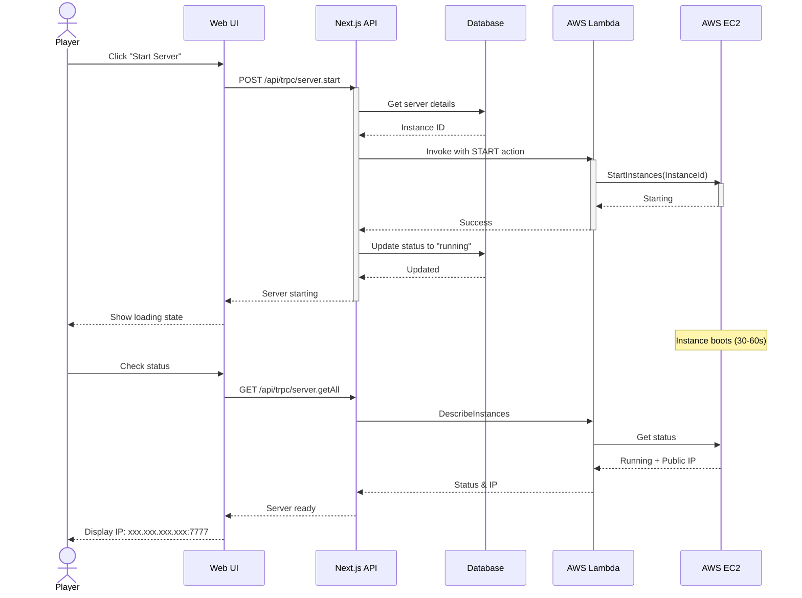

---

## 🔄 Sequence Diagram: Authentication Flow (Cognito)

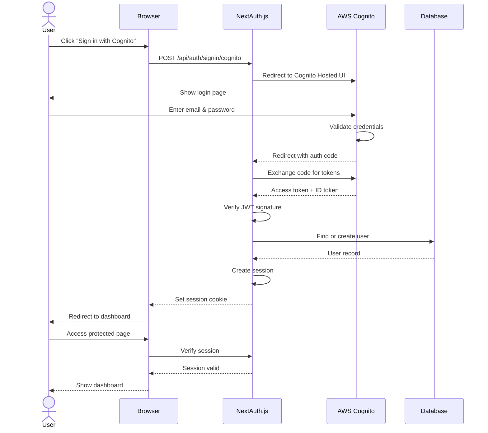

---

## 🔄 Sequence Diagram: Mock Authentication

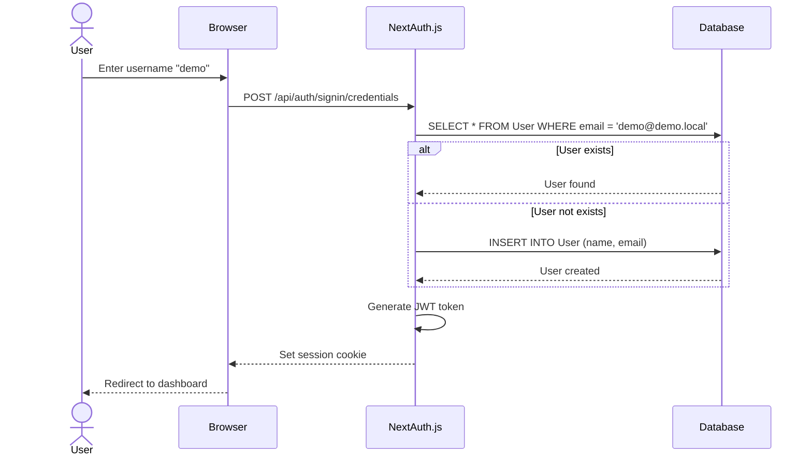

---

## 📐 Architecture Diagram

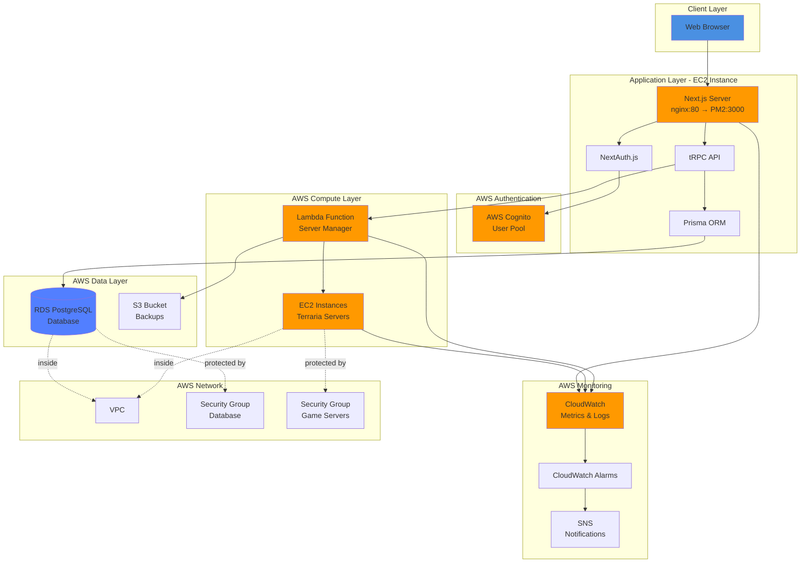

---

## 🏗️ Component Diagram

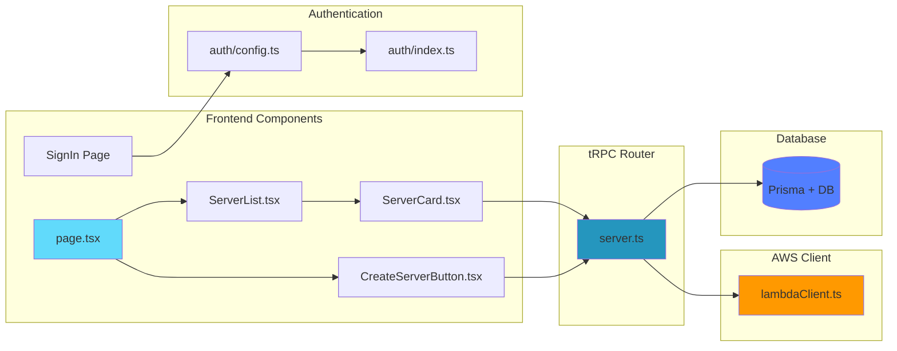

---

## 🔐 Security Flow Diagram

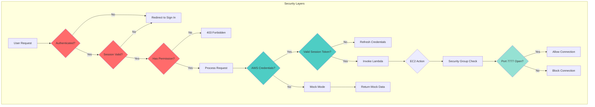

---

## 📊 Data Flow Diagram

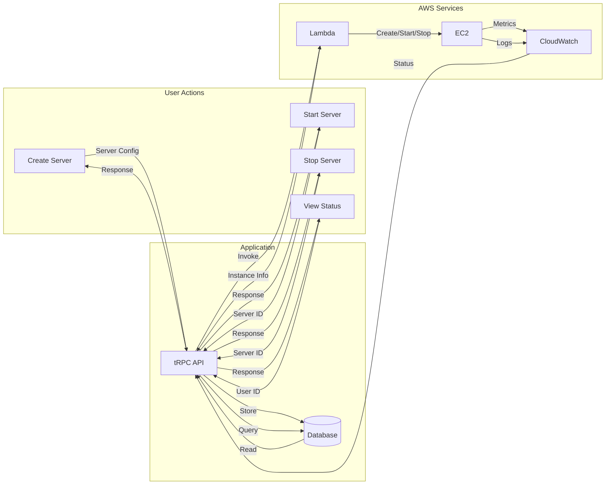

---

## 🎮 Player Journey Map

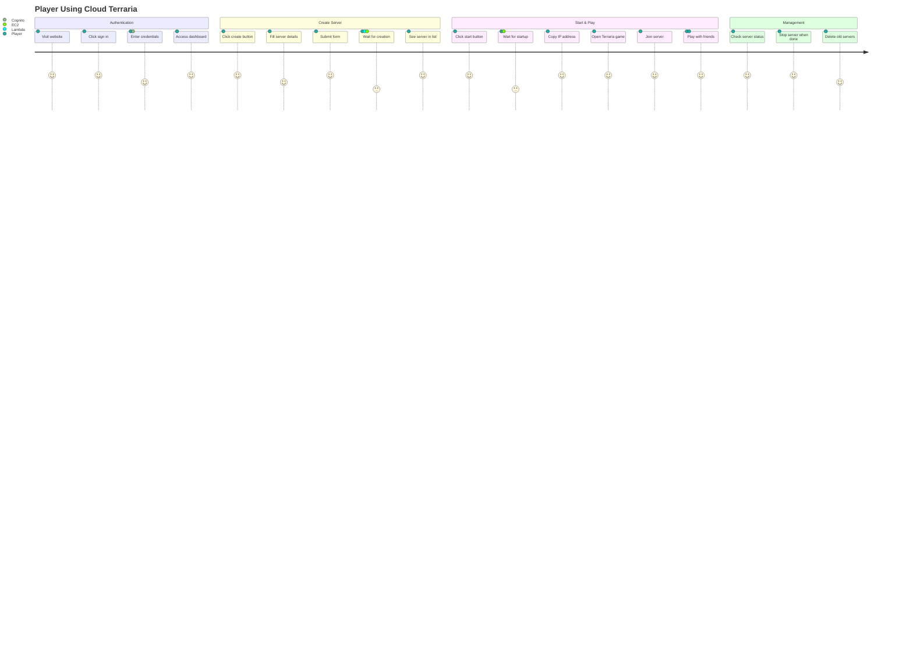

---

## 🔄 State Diagram: Server Lifecycle

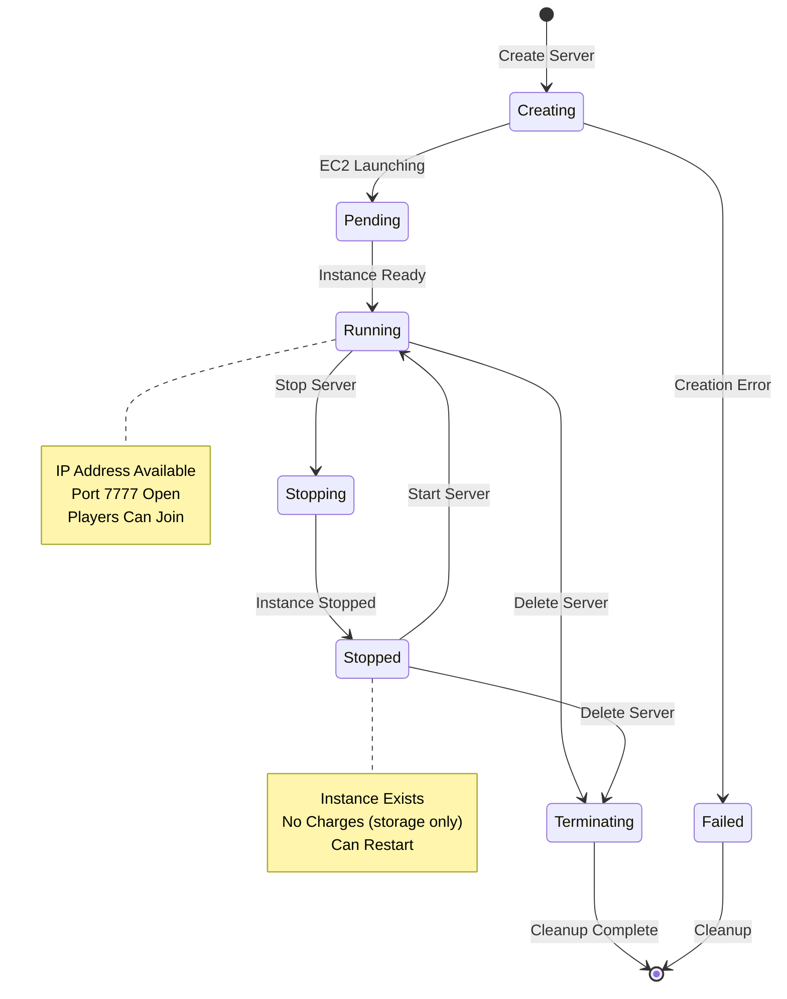

---

## 📈 Deployment Diagram

```mermaid
graph TB
    subgraph "Development"
        Dev[Developer Machine<br/>SQLite + Mock]
    end
    
    subgraph "Version Control"
        GitHub[GitHub Repository]
    end
    
    subgraph "Production - AWS Cloud us-east-1"
        subgraph "VPC"
            subgraph "Public Subnet"
                EC2Web[EC2 Instance<br/>nginx + Next.js + PM2]
            end
            
            subgraph "Private Subnet"
                RDS[(RDS PostgreSQL<br/>Database)]
            end
        end
        
        Cognito[AWS Cognito<br/>User Pool]
        Lambda[Lambda Function<br/>Server Manager]
        EC2Game[EC2 Instances<br/>Terraria Servers]
        S3[S3 Bucket<br/>Backups]
        CloudWatch[CloudWatch<br/>Monitoring]
    end
    
    subgraph "Players"
        Browser[Web Browser<br/>Port 80/443]
        Game[Terraria Client<br/>Port 7777]
    end
    
    Dev -->|Push Code| GitHub
    GitHub -->|Pull & Deploy| EC2Web
    
    Browser -->|HTTPS| EC2Web
    EC2Web --> Cognito
    EC2Web --> RDS
    EC2Web --> Lambda
    
    Lambda --> EC2Game
    Lambda --> S3
    EC2Game --> S3
    
    Game -.->|Game Traffic| EC2Game
    
    EC2Web --> CloudWatch
    EC2Game --> CloudWatch
    Lambda --> CloudWatch
    
    style Dev fill:#4a90e2
    style EC2Web fill:#ff9900
    style GitHub fill:#333
    style Lambda fill:#ff9900
    style EC2Game fill:#ff9900
    style RDS fill:#527fff
    style S3 fill:#569a31
    style Browser fill:#4ae290
    style Game fill:#90ee90
```

---

## 📊 Summary

This document contains comprehensive system diagrams for the Cloud Terraria project:

1. **Use Case Diagram** - Shows all 12 use cases for Player, Admin, and AWS System actors
2. **Use Case Descriptions** - Detailed flows for each use case
3. **Sequence Diagrams** - Step-by-step flows for Create Server, Start Server, Cognito Auth, and Mock Auth
4. **Architecture Diagram** - Complete AWS architecture with all 12 services on EC2
5. **Component Diagram** - Frontend and backend code structure
6. **Security Flow** - Authentication and authorization decision flow
7. **Data Flow** - User actions to AWS services
8. **Player Journey** - End-to-end player experience
9. **State Diagram** - Server lifecycle states
10. **Deployment Diagram** - Development to production pipeline with EC2 hosting

**How to view:**
- GitHub: Automatically renders Mermaid diagrams
- VS Code: Install "Markdown Preview Mermaid Support" extension
- Browser: Open `http://localhost:3000/diagrams.html` for interactive version

**Architecture Highlights:**
- 🌐 Next.js web app runs on EC2 with nginx reverse proxy
- 🔐 AWS Cognito for authentication (optional mock mode)
- 🗄️ RDS PostgreSQL for production database
- ⚡ Lambda functions manage EC2 game servers
- 🎮 Dedicated EC2 instances for Terraria servers
- 💾 S3 for world backups
- 📊 CloudWatch + SNS for monitoring and alerts
- 🔒 VPC with security groups for network isolation
    
    Dev -->|Push Code| Repo
    Repo -->|Deploy| Vercel
    
    Vercel -->|Auth| Cognito
    Vercel -->|Database| RDS
    Vercel -->|Invoke| Lambda
    
    Lambda -->|Manage| EC2
    Lambda -->|Store Backups| S3
    
    EC2 -->|Logs| CW
    Lambda -->|Logs| CW
    CW -->|Alerts| SNS
    
    style Dev fill:#4a90e2
    style Vercel fill:#000000,color:#fff
    style EC2 fill:#ff9900
    style Lambda fill:#ff9900
    style RDS fill:#527FFF
```

---

**สรุป**: ครบทุก diagram ที่ต้องการสำหรับนำเสนอโปรเจค! 🎉
